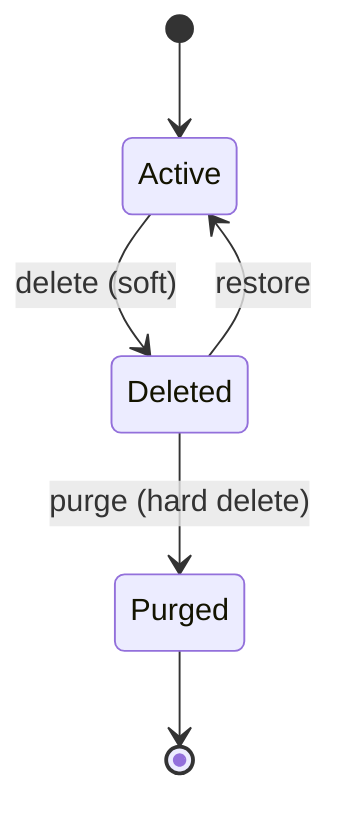
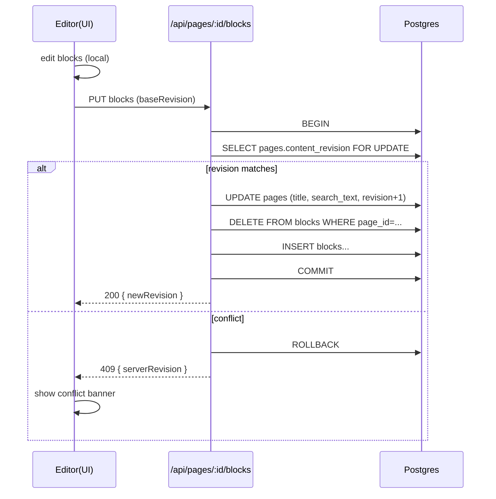

# 詳細設計書（シンプルNotion風メモアプリ）

更新日: 2026-02-04  
対象: MVP〜V1（アクティブユーザー ≈ 50名）  
デプロイ: Vercel（Production / Preview / Development）  
技術: Next.js（App Router）+ TypeScript / Node Runtime  
DB: Neon（Postgres）  
AI: Gemini API（Gemini 3 Flash）  
要件: モバイル最適化必須

---

## 目次

1. 前提・用語
2. システム構成（物理/論理）
3. リポジトリ構成（Next.js App Router）
4. 画面詳細（UI/UX、状態、モバイル）
5. ドメインモデル（エンティティ・状態遷移）
6. データ設計（Postgres: 物理DDL、インデックス、制約）
7. 編集モデル（ブロック仕様、保存・同期、競合）
8. 検索設計（MVP→FTS移行）
9. API詳細（Route Handlers / Server Actions、スキーマ、エラー）
10. AI設計（Gemini 3 Flash: 仕様、プロンプト、レート制限）
11. セキュリティ設計（認証・認可、入力検証、XSS、ログ）
12. 運用設計（Vercel環境、Preview DB、マイグレーション、監視）
13. テスト設計（Unit/Integration/E2E）
14. 将来拡張（V1/V2ロードマップ）

---

## 1. 前提・用語

### 1.1 前提
- MVPは「個人利用ファースト」。共有・コメント・リアルタイム共同編集は後回し。
- DBアクセスは**サーバー側のみ**（Server Actions / Route Handlers）。クライアント直DB禁止。
- 初期ユーザー規模（アクティブ ≈ 50名）では、極端なスケール最適化より「堅牢性・シンプルさ・速度感」を優先。

### 1.2 用語
- **ページ（Page）**: メモの単位（タイトル + ブロック群 + タグ等）
- **ブロック（Block）**: ページ本文の構造要素（段落、見出し、ToDo…）
- **スナップショット（Revision）**: ページの軽量履歴（復旧用）
- **Preview環境**: PR/ブランチごとのVercelデプロイ
- **Development環境**: ローカル開発（`pnpm dev` / `vercel dev`）

---

## 2. システム構成（物理/論理）

### 2.1 物理構成
- Vercel: Next.js（Node runtime）をホスティング
- Neon Postgres: データ永続化
- Gemini API: AI提案（タイトル/要約/タグ）

```mermaid
flowchart LR
  U[User (Mobile/Desktop)] -->|HTTPS| V[Vercel: Next.js App Router (Node)]
  V -->|SQL| N[(Neon Postgres)]
  V -->|HTTPS| G[Gemini API (Gemini 3 Flash)]
```

### 2.2 論理レイヤ
- UI層: Server Components中心 + 必要箇所のみClient Components
- Application層: actions（書き込み）、services（ドメイン処理）、validators
- Infrastructure層: db（Neon接続）、ai（Gemini呼び出し）、storage（画像が必要になったら）

---

## 3. リポジトリ構成（Next.js App Router）

### 3.1 ディレクトリ案（MVP）

```
app/
  (auth)/
    sign-in/page.tsx
  (app)/
    layout.tsx
    page.tsx                # Home (Recent)
    notes/page.tsx          # All notes
    favorites/page.tsx
    tags/page.tsx
    trash/page.tsx
    settings/page.tsx
    p/[pageId]/page.tsx     # Editor
  api/
    pages/route.ts
    pages/[pageId]/route.ts
    pages/[pageId]/blocks/route.ts
    pages/[pageId]/restore/route.ts
    pages/[pageId]/revisions/route.ts
    tags/route.ts
    tags/[tagId]/route.ts
    search/route.ts
    ai/title-suggest/route.ts
    ai/summarize/route.ts
    ai/tag-suggest/route.ts

src/
  lib/
    auth/                   # 認証抽象（実装差し替え可能）
      session.ts
      require-user.ts
    db/
      client.ts             # Neon接続
      queries.ts            # SQL（parameterized）
      schema.sql            # DDL（参考/生成元でもOK）
    ai/
      gemini.ts
      prompts.ts
    validators/
      page.ts
      block.ts
      tag.ts
      ai.ts
    domain/
      blocks/
        types.ts
        normalize.ts
        extract-text.ts
      pages/
        service.ts
      tags/
        service.ts
      revisions/
        service.ts
    ui/
      tokens.css
      components/
        Sidebar.tsx
        CommandPalette.tsx
        NoteList.tsx
        Editor.tsx
        BlockRenderer.tsx
        dialogs/
        toasts/
  styles/
```

### 3.2 実装ポリシー
- 読み取り: RSCからサーバーでDBアクセスし描画（ユーザーごと動的 → no-store 相当）
- 書き込み: 原則 Server Actions（UI直結） or Route Handler（汎用/AI/外部連携）
- SQL: すべて parameterized（$1, $2...）
- 最小差分: 大規模リファクタを避け、段階導入できる構造

---

## 4. 画面詳細（UI/UX、状態、モバイル）

デザイン仕様（色・アイコン・影・装飾・アニメーション）は別紙（システムデザイン仕様書）に準拠。
ここでは「画面の構成」「操作」「状態」「モバイル最適化」を詳細化する。

### 共通UI（全画面）
- サイドバー（Desktop固定 / Mobileドロワー）
  - 最近 / すべて / お気に入り / タグ / ゴミ箱 / 設定
  - 下部にユーザーメニュー（サインアウト）
- ヘッダー
  - 左: パンくず（任意）
  - 中央: 現在画面タイトル
  - 右: 検索（Cmd/Ctrl+K）/ 新規メモ

### 共通状態
- Loading: Skeleton
- Empty: イラスト + 1行説明 + Primaryボタン
- Error: 短い説明 + 再試行ボタン（詳細はログへ）

### 4.1 S-01 サインイン
目的: 認証

要素
- サインイン方法（メール/SSOはプロダクト方針で決定）
- 利用規約リンク（任意）

状態
- 認証中（ボタンローディング）
- 失敗（エラー短文）

モバイル
- 入力は1カラム、キーボード表示時のスクロール崩れ回避

### 4.2 S-02 ホーム（最近）
目的: 直近の作業再開

要素
- 最近開いたページ（最大 20）
- ピン（お気に入り上位を固定表示、任意）
- 新規メモ CTA

操作
- ページクリック → エディタへ
- 新規メモ → 即エディタ（タイトル未入力でもOK）

モバイル
- 一覧はカード間隔を広めに（誤タップ防止）

### 4.3 S-03 すべてのメモ
目的: 一覧管理・フィルタ

要素
- ソート: 更新順 / 作成順 / タイトル
- フィルタ: タグ / フォルダ（parent）
- ページ一覧（タイトル、更新日時、タグchips）

操作
- スクロールで追加読み込み（cursor pagination）
- 行の右側メニュー（…）: お気に入り、移動、削除

モバイル
- 行をタップで詳細、スワイプで「お気に入り/削除」（将来）
- フィルタはボトムシート

### 4.4 S-04 エディタ（ページ）
目的: 作成/編集（最重要）

構成（Desktop）
- 上部: タイトル（1行入力）
- 本文: ブロックリスト（クリックで編集）
- 右上: AI ボタン（タイトル/要約/タグ提案）

構成（Mobile）
- タイトル → 本文（縦）
- フローティング +（ブロック追加） / AI
- 入力中ツールバー（最低限: ブロック追加 / ToDo / 見出し）

操作
- Enter: 新規ブロック（同タイプ）
- Backspace（空ブロック）: 前ブロックへ結合 or 削除
- / コマンド: ブロック変換/追加
- 画像: ドラッグ&ドロップ（Desktop）/ ファイル選択（Mobile）
- 自動保存: デバウンス（例: 800ms） + 明示保存不要
- ページメニュー: お気に入り、削除、エクスポート（Markdown）

状態
- 保存中（小さなインジケータ）
- 保存失敗（トースト + 再送ボタン）
- 競合（別タブ更新）: 上部にバナー表示（「再読み込み」「この内容で上書き」）

### 4.5 S-05 検索/コマンドパレット
目的: 探す/操作を集約

起動
- Cmd/Ctrl+K
- モバイル: ヘッダーの検索アイコン

要素
- 入力欄
- 結果: ページ（タイトル + スニペット）
- アクション: 新規作成、タグ付け（将来）

状態
- 入力なし: 最近/おすすめ
- 結果なし: Empty

### 4.6 S-06 タグ管理
目的: タグの運用

要素
- タグ一覧（件数表示）
- 作成/リネーム/削除
- （任意）色設定

制約
- 同一ワークスペースでタグ名重複不可（case-insensitive推奨）

### 4.7 S-07 お気に入り
目的: 重要メモの固定

要素
- お気に入り一覧
- 並び替え（更新順/手動は将来）

### 4.8 S-08 ゴミ箱
目的: 復元/完全削除

要素
- 削除済みページ一覧
- 復元ボタン
- 完全削除（確認ダイアログ必須）

運用
- 保持期限はMVPでは無期限 or 30日など。要件化する場合はジョブが必要（後述）。

### 4.9 S-09 設定
目的: 基本設定

要素（MVP）
- プロフィール表示
- ショートカット一覧
- エクスポート（ページ単位 Markdown）
- サインアウト

---

## 5. ドメインモデル（エンティティ・状態遷移）

### 5.1 エンティティ
- User
- Workspace（MVPは1ユーザー=1ワークスペースで運用可）
- Page
- Block
- Tag / PageTag
- PageRevision（スナップショット）

### 5.2 Page 状態遷移



---

## 6. データ設計（Postgres: 物理DDL、インデックス、制約）

実装は「マイグレーションツール（例: drizzle-kit / node-pg-migrate 等）」で管理する。
ここでは基準DDLを示す（最小で堅牢な制約を含む）。

### 6.1 拡張

```sql
-- UUID生成を使う場合
create extension if not exists pgcrypto;
```

### 6.2 テーブルDDL（基準）

#### users

```sql
create table if not exists users (
  id uuid primary key default gen_random_uuid(),
  email text not null unique,
  name text,
  created_at timestamptz not null default now()
);
```

#### workspaces

```sql
create table if not exists workspaces (
  id uuid primary key default gen_random_uuid(),
  owner_user_id uuid not null references users(id) on delete cascade,
  name text not null default 'My Workspace',
  created_at timestamptz not null default now()
);

create unique index if not exists workspaces_owner_user_id_uq on workspaces(owner_user_id);
```

#### pages

```sql
create table if not exists pages (
  id uuid primary key default gen_random_uuid(),
  workspace_id uuid not null references workspaces(id) on delete cascade,
  parent_page_id uuid references pages(id) on delete set null,

  title text not null default '',
  icon text,
  cover_url text,

  is_favorite boolean not null default false,
  is_deleted boolean not null default false,
  deleted_at timestamptz,

  -- 最近/並び替え用
  last_opened_at timestamptz,

  -- 競合検知（楽観ロック）
  content_revision integer not null default 0,

  -- 検索用（MVP: text、V1: tsvector追加）
  search_text text not null default '',

  created_at timestamptz not null default now(),
  updated_at timestamptz not null default now()
);

create index if not exists pages_ws_updated_idx on pages(workspace_id, updated_at desc);
create index if not exists pages_ws_fav_updated_idx on pages(workspace_id, is_favorite, updated_at desc);
create index if not exists pages_ws_deleted_updated_idx on pages(workspace_id, is_deleted, updated_at desc);
create index if not exists pages_ws_parent_idx on pages(workspace_id, parent_page_id);
```

#### blocks

ネストが必要（toggle/listの子要素）なため `parent_block_id` を持つ。リストの階層は `indent`（0..N）で表現（toggleは `parent_block_id` で表現）。

```sql
create table if not exists blocks (
  id uuid primary key,
  page_id uuid not null references pages(id) on delete cascade,
  parent_block_id uuid references blocks(id) on delete cascade,

  type text not null,
  indent smallint not null default 0,
  order_index integer not null,

  content jsonb not null default '{}'::jsonb,

  created_at timestamptz not null default now(),
  updated_at timestamptz not null default now(),

  constraint blocks_type_chk check (type in (
    'paragraph','heading','bulleted_list','numbered_list','todo',
    'toggle','quote','divider','callout','image'
  )),
  constraint blocks_indent_chk check (indent >= 0 and indent <= 10)
);

create index if not exists blocks_page_order_idx on blocks(page_id, order_index);
create index if not exists blocks_page_parent_idx on blocks(page_id, parent_block_id);
```

#### tags

```sql
create table if not exists tags (
  id uuid primary key default gen_random_uuid(),
  workspace_id uuid not null references workspaces(id) on delete cascade,
  name text not null,
  color text,

  created_at timestamptz not null default now(),
  updated_at timestamptz not null default now()
);

-- case-insensitive unique（運用上重要）
create unique index if not exists tags_ws_name_ci_uq
on tags(workspace_id, lower(name));
```

#### page_tags

```sql
create table if not exists page_tags (
  page_id uuid not null references pages(id) on delete cascade,
  tag_id uuid not null references tags(id) on delete cascade,
  created_at timestamptz not null default now(),
  primary key (page_id, tag_id)
);

create index if not exists page_tags_tag_idx on page_tags(tag_id);
```

#### page_revisions（スナップショット）

```sql
create table if not exists page_revisions (
  id uuid primary key default gen_random_uuid(),
  page_id uuid not null references pages(id) on delete cascade,
  snapshot jsonb not null,
  created_by uuid not null references users(id) on delete cascade,
  created_at timestamptz not null default now()
);

create index if not exists page_revisions_page_created_idx on page_revisions(page_id, created_at desc);
```

### 6.3 updated_at更新（トリガ or アプリ）

MVPはアプリ側で更新してもよいが、更新漏れ防止のためトリガも可。

```sql
create or replace function set_updated_at()
returns trigger as $$
begin
  new.updated_at = now();
  return new;
end;
$$ language plpgsql;

drop trigger if exists trg_pages_updated_at on pages;
create trigger trg_pages_updated_at
before update on pages
for each row execute function set_updated_at();

drop trigger if exists trg_blocks_updated_at on blocks;
create trigger trg_blocks_updated_at
before update on blocks
for each row execute function set_updated_at();

drop trigger if exists trg_tags_updated_at on tags;
create trigger trg_tags_updated_at
before update on tags
for each row execute function set_updated_at();
```

---

## 7. 編集モデル（ブロック仕様、保存・同期、競合）

### 7.1 ブロック型（TypeScript）

```ts
export type BlockType =
  | "paragraph"
  | "heading"
  | "bulleted_list"
  | "numbered_list"
  | "todo"
  | "toggle"
  | "quote"
  | "divider"
  | "callout"
  | "image";

export type Block = {
  id: string; // uuid（client生成可）
  pageId: string;
  parentBlockId: string | null;
  type: BlockType;
  indent: number; // list用
  orderIndex: number; // 0..n（保存時に採番し直し）
  content: Record<string, unknown>; // 型ごとにZodで検証
};
```

### 7.2 contentスキーマ（MVP最小）

MVPは「プレーンテキスト中心」。インライン装飾（bold/italic等）はV1以降で拡張。

- paragraph: `{ text: string }`
- heading: `{ level: 1 | 2 | 3, text: string }`
- bulleted_list / numbered_list: `{ text: string }`（1ブロック=1アイテムとして扱う）
- todo: `{ text: string, checked: boolean }`
- toggle: `{ text: string }`（子要素は parentBlockId で紐付く）
- quote: `{ text: string }`
- divider: `{}`（content不要）
- callout: `{ text: string, emoji?: string }`
- image: `{ url: string, alt?: string, width?: number, height?: number }`

### 7.3 正規化（保存前）
- 空の連続ブロックを整理（任意）
- heading level範囲チェック
- indent範囲チェック
- parentBlockId参照整合性（存在しないparentをnullへ）

### 7.4 自動保存（Autosave）

クライアント側アルゴリズム（推奨）

- 編集操作 → ローカル状態更新（即時）
- debounce(800ms) で保存キュー
- 保存中にさらに編集 → 次の保存を予約（直列化）
- 保存失敗 → トースト表示 + 再送ボタン

サーバー側保存（トランザクション）

- 競合検知（楽観ロック）: content_revision を利用
- 成功時: content_revision += 1 を返す（クライアントが追従）

### 7.5 競合（別タブ/別端末）

- 保存リクエストに baseRevision を必須
- サーバーの content_revision と一致しない場合は 409 CONFLICT
- クライアントは次を提示:
  - 「再読み込み（サーバー内容を反映）」
  - 「上書き保存（強制）」（MVPでは許可しても良いが、明示確認必須）

---

## 8. 検索設計（MVP→FTS移行）

### 8.1 MVP検索

対象: pages.title + pages.search_text

実装:
- q をトリムし、最低文字数（例: 2）を満たさなければ空結果
- SQLは ILIKE（パラメタ化）
- search_text は「ブロックから抽出したテキスト連結」を保存時に更新する

### 8.2 search_text生成

- 保存時にサーバーで blocks を走査しテキスト抽出
- divider/image 等は除外
- 1ページあたり最大文字数（例: 20,000）でクリップ（検索性能とDB肥大を防止）

### 8.3 V1: Postgres FTS

- pages.search_tsv tsvector を追加し GIN インデックスを作成
- 更新: search_text 更新時に to_tsvector を生成（trigger or アプリ側）

---

## 9. API詳細（Route Handlers / Server Actions）

MVPは「内部アプリ用API」。外部公開は想定しない。
すべてのエンドポイントで認証必須、かつ workspace_id で認可。

### 9.1 共通仕様

Base: `/api`

Content-Type: `application/json`

エラー形式:

```json
{
  "ok": false,
  "error": {
    "code": "VALIDATION",
    "message": "Invalid input",
    "fields": { "title": "Required" }
  }
}
```

エラーコード
- UNAUTHORIZED (401)
- FORBIDDEN (403)
- NOT_FOUND (404)
- VALIDATION (400)
- RATE_LIMIT (429)
- CONFLICT (409)
- INTERNAL (500)

### 9.2 Pages

#### GET /api/pages

Query
- scope: recent | all | favorites | trash
- tagId?: uuid
- parentId?: uuid
- limit?: number（default 20, max 50）
- cursor?: string（updatedAt|id など）

Response

```json
{
  "ok": true,
  "data": {
    "items": [
      {
        "id": "uuid",
        "title": "string",
        "isFavorite": true,
        "updatedAt": "2026-02-04T...",
        "deletedAt": null
      }
    ],
    "nextCursor": "..."
  }
}
```

実装メモ
- trash は is_deleted = true のみ
- recent は last_opened_at desc nulls last、なければ updated_at desc

#### POST /api/pages

Body

```json
{
  "title": "Untitled",
  "parentPageId": null
}
```

Response

```json
{
  "ok": true,
  "data": {
    "id": "uuid",
    "contentRevision": 0
  }
}
```

備考
- 新規作成時、最低1つの空paragraphブロックを作っても良い（UX）

#### GET /api/pages/:pageId

Response

```json
{
  "ok": true,
  "data": {
    "id": "uuid",
    "title": "string",
    "parentPageId": null,
    "isFavorite": false,
    "isDeleted": false,
    "contentRevision": 12,
    "createdAt": "...",
    "updatedAt": "...",
    "lastOpenedAt": "..."
  }
}
```

#### PATCH /api/pages/:pageId

Body（部分更新）

```json
{
  "title": "New title",
  "isFavorite": true,
  "parentPageId": "uuid-or-null"
}
```

#### POST /api/pages/:pageId/restore

- is_deleted=false, deleted_at=null

#### DELETE /api/pages/:pageId

- 完全削除（確認ダイアログ必須）
- 関連する blocks / page_tags / revisions も cascade で削除

### 9.3 Blocks

#### GET /api/pages/:pageId/blocks

Response

```json
{
  "ok": true,
  "data": {
    "blocks": [
      /* flattened blocks */
    ]
  }
}
```

#### PUT /api/pages/:pageId/blocks

Body

```json
{
  "baseRevision": 12,
  "title": "string",
  "blocks": [
    {
      "id": "uuid",
      "parentBlockId": null,
      "type": "paragraph",
      "indent": 0,
      "orderIndex": 0,
      "content": { "text": "..." }
    }
  ]
}
```

Success Response

```json
{
  "ok": true,
  "data": {
    "contentRevision": 13,
    "updatedAt": "..."
  }
}
```

Conflict Response（409）

```json
{
  "ok": false,
  "error": {
    "code": "CONFLICT",
    "message": "Content was updated elsewhere",
    "serverRevision": 15
  }
}
```

サーバー処理（必須）
- 入力検証（block typeごとのcontent schema）
- 認可（workspace一致）
- トランザクション:
  - `select content_revision from pages where id=$1 and workspace_id=$2 for update`
  - baseRevision一致チェック
  - pages更新（title, search_text, content_revision+1）
  - blocks全削除 → 再insert（order_indexはサーバーで採番し直し推奨）
  - commit

### 9.4 Tags

#### GET /api/tags

- workspace内のタグ一覧（件数付きは将来）

#### POST /api/tags

```json
{ "name": "Work", "color": "#FFD166" }
```

#### PATCH /api/tags/:tagId

```json
{ "name": "Work Log", "color": null }
```

#### DELETE /api/tags/:tagId

参照中の場合:
- MVP方針A: 400で拒否（先に付け替え）
- MVP方針B: page_tagsを削除してタグ削除（確認必須）
- 推奨: 方針A（事故防止）

### 9.5 Search

#### GET /api/search?q=...&limit=...

Response

```json
{
  "ok": true,
  "data": {
    "items": [
      {
        "id": "uuid",
        "title": "string",
        "snippet": "string"
      }
    ]
  }
}
```

### 9.6 Revisions

#### GET /api/pages/:pageId/revisions?limit=20

- created_at desc

#### POST /api/pages/:pageId/revisions

Body

```json
{
  "reason": "manual"
}
```

---

## 10. AI設計（Gemini 3 Flash）

### 10.1 AIの役割（MVP）
- タイトル提案（3案）
- 要約（3〜5行 + 箇条書き要点）
- タグ提案（既存タグ候補 + 新規タグ案）

### 10.2 AI呼び出し方針
- AIはサーバーのみで実行（APIキー保護）
- 入力は最小化（ページ全量送信を避け、抽出テキストを送る）
- 出力は構造化JSONを基本（パース失敗時フォールバック）

### 10.3 AIエンドポイント

#### POST /api/ai/title-suggest

Body

```json
{
  "pageId": "uuid",
  "language": "ja",
  "contextText": "extracted text (max N chars)"
}
```

Response

```json
{
  "ok": true,
  "data": { "suggestions": ["...", "...", "..."] }
}
```

#### POST /api/ai/summarize

Body

```json
{
  "pageId": "uuid",
  "language": "ja",
  "contextText": "..."
}
```

Response

```json
{
  "ok": true,
  "data": {
    "summary": "3-5 lines",
    "bullets": ["...", "...", "..."]
  }
}
```

#### POST /api/ai/tag-suggest

Body

```json
{
  "pageId": "uuid",
  "language": "ja",
  "contextText": "...",
  "existingTags": [
    { "id": "uuid", "name": "Work" }
  ]
}
```

Response

```json
{
  "ok": true,
  "data": {
    "existingTagIds": ["uuid"],
    "newTagNames": ["..."]
  }
}
```

### 10.4 AIプロンプト（サーバー側テンプレ）

実装では「絶対にJSONだけ」を狙う。

例（title-suggest）:
- System（概念）
  - あなたは日本語の編集アシスタント
  - 出力はJSONのみ
  - フィールド: suggestions: string[]、3件、各40文字以内
- User
  - contextText を貼り付け

同様に summarize / tag-suggest も JSON schema固定で指示。

### 10.5 レート制限（AI）

50名規模でもAIはコストと濫用対策が必要。

推奨: ユーザー単位で 10 req / 10 min など

MVP実装案（Postgres簡易）
- rate_limits テーブルで「窓ごとのカウント」を管理（TTLは後述）
- あるいは、より簡単に「直近呼び出し時刻 + 最短間隔（例: 2秒）」をDBに保存

最小実装例:
- ai_last_called_at を users か別テーブルに保持
- 2秒以内の連続呼び出しは 429

---

## 11. セキュリティ設計（認証・認可、入力検証、XSS、ログ）

### 11.1 認証

実装は任意（Auth.js/自前/外部IdP）。
詳細設計としては「抽象インターフェース」で固定する。

必須関数
- `getSessionUser(): { userId, workspaceId } | null`
- `requireUser(): { userId, workspaceId }`（未認証なら401）

### 11.2 認可

- すべてのDBクエリに `workspace_id = session.workspaceId` 条件を必須化
- `pageId` 直指定のAPIは必ず「そのページがworkspace内か」を検査

### 11.3 入力検証

- API境界でZod等により検証
- blocksは typeごとに content schemaを固定し、未知フィールドを落とす（strict）

### 11.4 XSS対策

- HTML保存禁止（contentはJSON）
- レンダリング時に `dangerouslySetInnerHTML` を使わない
- もしMarkdownレンダリングを導入するならサニタイズ必須（MVPでは非推奨）

### 11.5 ログ

- ユーザー本文・APIキー・DB URLはログ禁止
- 例外ログには requestId / userId / route / latency / errorCode を含める

---

## 12. 運用設計（Vercel環境、Preview DB、マイグレーション、監視）

### 12.1 Vercel環境

- Production: 本番DB（Neon main/prod）
- Preview: PRごとにNeon branch（推奨）
- Development: ローカル（.env.local）

### 12.2 環境変数（サーバー専用）

- DATABASE_URL
- DATABASE_URL_UNPOOLED（migration用）
- GEMINI_API_KEY

※ `NEXT_PUBLIC_` 系に秘密を入れない（レビュー項目）

### 12.3 マイグレーション

- `pnpm migrate` を用意
- Preview/Productionのbuildに組み込むかはチーム方針だが、Previewでスキーマが揃うと検証が安定する

### 12.4 監視

- 例外監視（Sentry等）推奨
- DBの遅いクエリを把握（Neon側のメトリクス、SQLログ）

---

## 13. テスト設計（Unit/Integration/E2E）

### 13.1 Unit
- ブロック正規化
- search_text抽出
- AI JSONパースとフォールバック

### 13.2 Integration
- pages/blocks保存のトランザクション整合性
- 競合（409）分岐
- 認可（workspace外アクセス拒否）

### 13.3 E2E（最小）
- 新規メモ→入力→自動保存→再読込→内容一致
- 検索→ヒット→遷移
- 削除→ゴミ箱→復元
- モバイル幅でエディタ操作（viewport切替）

---

## 14. 将来拡張（V1/V2ロードマップ）

### V1
- Postgres FTS（tsvector + GIN）
- 画像アップロード（ストレージ抽象化）
- タグの統合（merge）と運用改善

### V2
- 共有リンク（閲覧のみ）→権限モデル拡張
- コメント
- 簡易コレクション（DB軽量版：リストのみ）

---

## 付録A: ブロック保存のシーケンス（Autosave）



## 付録B: モバイル最適化チェックリスト（MVP）

- タップ領域（目安44px）を満たす
- ドロワー開閉、コマンドパレット、ボトムシートが片手操作を阻害しない
- 入力時（ソフトキーボード表示）にUIが隠れない
- エディタ操作（Enter/削除/ブロック追加）がタッチでも完結する
- 低速回線でも「最近/一覧」は先にタイトルだけ表示できる（段階描画）
